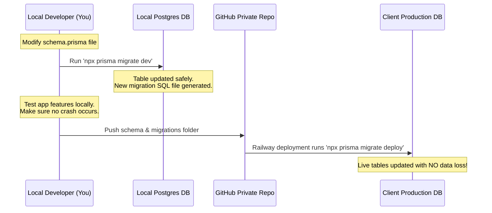

# Cambridge Garden Centre (CGC) - Production Release & Long-term Maintenance Strategy

This document provides a highly detailed, step-by-step checklist to take your React + Node.js (Vite + Prisma + Express) application to production, configure the Supabase CLI, and run safe long-term updates without breaking the live app.

---

## 🛠️ PART 1: The Initial Production Launch (Going Live)

Follow these micro-steps to deploy the application for the first time.

### Micro-Step 1.1: Project Audits and Cleanup
1. **Double-Check `.gitignore`**: Ensure that `backend/.env`, `frontend/.env`, `node_modules`, and `.env.local` are in your `.gitignore` files. Run `git status` in the terminal to verify no `.env` files are tracked.
2. **Scan for Hardcoded Secrets**: Ensure there are no active API keys, passwords, or S3 credentials hardcoded in your TS/JS files. All credentials must reference `process.env`.
3. **Local Production Build Test**:
   * **Backend**: Run `npm run build` in the `backend` folder. Verify that the TypeScript compiles without errors and outputs a `/dist` directory.
   * **Frontend**: Run `npm run build` in the `frontend` directory. Verify that Vite successfully builds the static bundle inside `/dist` with zero bundler errors.

### Micro-Step 1.2: Prepare the Production Supabase Database
1. **Create the Production Supabase Project**:
   * Create a new project in your Supabase dashboard (e.g., `CGC Production`).
   * Select the appropriate AWS/GCP region closest to your client (e.g., Singapore or US).
2. **Retrieve Connection Strings**:
   * Navigate to **Settings** > **Database** in Supabase.
   * Copy the **Connection String (Transaction Pooler - Mode: Session)** to use for Prisma migration.
   * Add `?pgbouncer=true&connection_limit=1` to the end of the Pooler URL for Prisma.
   * Copy the **Direct Connection String** (direct connection to Postgres on port 5432) for your `DIRECT_URL`.
3. **Enable Storage Bucket**:
   * Navigate to **Storage** in your Supabase dashboard.
   * Create a bucket named exactly as in your config: `tickets-and-invoices`.
   * Set the bucket to **Private** (or Public, but Private with Signed URLs is recommended for maximum security).

### Micro-Step 1.3: Deploy the Express Backend on Railway
1. **Log in to Railway**: Link your GitHub repository to your Railway project dashboard.
2. **Select the `backend` Directory**: Set the root directory of your Railway service to `backend`.
3. **Configure Environment Variables**:
   In Railway's **Variables** tab, add the production values for:
   * `NODE_ENV` = `production`
   * `PORT` = `4000` (or leave it blank to let Railway auto-assign)
   * `DATABASE_URL` = *[Production Supabase Transaction Pooler URL]*
   * `DIRECT_URL` = *[Production Supabase Direct Connection URL]*
   * `JWT_SECRET` = *[Secure 256-bit Random Secret String]*
   * `AWS_ACCESS_KEY_ID` / `AWS_SECRET_ACCESS_KEY` = *[Production AWS Keys]*
   * `AWS_REGION` = *[Your production AWS Region, e.g., us-east-1]*
   * `BEDROCK_MODEL_ID` = `anthropic.claude-3-haiku-20240307-v1:0`
   * `SUPABASE_URL` = *[Production Supabase URL]*
   * `SUPABASE_SERVICE_ROLE_KEY` = *[Production Supabase Service Role Key (secret)]*
   * `SUPABASE_STORAGE_BUCKET` = `tickets-and-invoices`
   * `GMAIL_CLIENT_ID` / `GMAIL_CLIENT_SECRET` / `GMAIL_REFRESH_TOKEN` = *[Production Google API keys]*
   * `GMAIL_USER` / `GMAIL_PASS` = *[Client's Gmail details]*
   * `FRONTEND_URL` = *[The production Vercel frontend domain URL]*
4. **Define Build Command & Pre-deploy migration**:
   * Set Railway's start command to: `npx prisma migrate deploy && npm run start`
   * *This ensures that every time Railway deploys your code, it automatically updates the Supabase schema first.*

### Micro-Step 1.4: Deploy the React Frontend on Vercel
1. **Link Repository to Vercel**: Import the GitHub repository into your Vercel dashboard.
2. **Configure Vercel Settings**:
   * **Framework Preset**: Vite
   * **Root Directory**: `frontend`
3. **Add Environment Variables**:
   In Vercel's settings, add:
   * `VITE_API_URL` = `https://cambridge-garden-centre-production-65ef.up.railway.app` (Your active Railway API domain)
4. **Trigger Build**: Click **Deploy** and verify that Vercel builds and hosts your frontend without errors.

---

## 🛠️ PART 2: The Supabase CLI Setup (Step-by-Step)

The Supabase CLI is the foundation of local testing. It runs a full Supabase environment inside Docker on your machine.

### Micro-Step 2.1: Local Installation
1. Make sure you have **Node.js** and **Docker** installed and running on your computer.
2. Open PowerShell or Command Prompt and install Supabase CLI globally:
   ```powershell
   npm install -g supabase
   ```
3. Verify the installation:
   ```powershell
   supabase --version
   ```

### Micro-Step 2.2: Initializing Supabase Locally
1. Navigate to the root directory of your project `d:\Visual Code\LegionAutomations\CGC`.
2. Initialize Supabase configurations:
   ```powershell
   supabase init
   ```
   *This creates a new folder named `supabase` at your project root containing configuration files, local schemas, and migration files.*

### Micro-Step 2.3: Starting the Local Docker Stack
1. Start the local emulator:
   ```powershell
   supabase start
   ```
   *This command downloads and runs Docker containers representing all Supabase microservices (PostgreSQL, Storage, Auth, Studio GUI).*
2. **Note your Local Credentials**:
   At the end of the startup sequence, the CLI prints your local URL endpoints and secret keys:
   * **Studio URL**: `http://localhost:54323` (Open in a browser to manage your local database just like the cloud!)
   * **API URL**: `http://localhost:54321`
   * **anon key**: *[Your local public key]*
   * **service_role key**: *[Your local superuser key]*

### Micro-Step 2.4: Linking CLI to Remote Cloud Projects
To push database structures or Edge Functions to your Staging or Production databases, link the CLI:
1. Log in to your cloud Supabase account:
   ```powershell
   supabase login
   ```
   *(This opens a browser window where you can log in and authorize the CLI)*
2. Link your CLI to your **Staging** project:
   ```powershell
   supabase link --project-ref <staging-project-ref-id>
   ```
   *(Enter your database password when prompted)*

---

## 🔁 PART 3: The Safe Maintenance Workflow (Database Migrations)

When the client asks for new features that require changing database tables or adding new fields, follow this strict, isolated workflow:



### 1. Make Changes Locally
* Modify the database schema in [schema.prisma](file:///d:/Visual%20Code/LegionAutomations/CGC/backend/prisma/schema.prisma). E.g., add a column or a table.

### 2. Generate and Apply Locally
* With your local backend environment connected to your local database, run:
  ```powershell
  npx prisma migrate dev --name <descriptive_change_name>
  ```
* **What this does**: Prisma applies the change locally, updates your local client typings, and writes a SQL script in `backend/prisma/migrations/<timestamp>_<name>/migration.sql`.

### 3. Verify Code Locally
* Boot your local backend and frontend (`npm run dev`). Try creating, reading, and updating entries under the new models. Confirm there are no application crashes or database errors.

### 4. Push to Repository
* Add and push the schema changes and migration script to GitHub:
  ```powershell
  git add backend/prisma/schema.prisma backend/prisma/migrations/
  git commit -m "migration: added custom client fields"
  git push origin main
  ```

### 5. Automated Cloud Application
* When Railway pulls your new branch code, it executes:
  ```bash
  npx prisma migrate deploy
  ```
  `prisma migrate deploy` looks at the production Supabase database, sees the new migration SQL script, and applies it cleanly. **It never deletes existing production records, preserving your client's live data.**

---

## ⚡ PART 4: The Safe Maintenance Workflow (Edge Functions)

Follow these steps when developing and releasing updates to Supabase Edge Functions.

### 1. Develop/Test Locally
1. Make sure your local Docker stack is active: `supabase start`.
2. Start the local server watch:
   ```powershell
   supabase functions serve --env-file ./supabase/.env.local
   ```
3. Create or modify your functions inside `supabase/functions/<function-name>/index.ts`.
4. Trigger the local URL `http://127.0.0.1:54321/functions/v1/<function-name>` using Postman, curl, or your local frontend client to verify the response.

### 2. Test in Staging (Cloud)
To verify how the function works over live networks before going to production:
1. Deploy the function to your staging project using the staging reference id:
   ```powershell
   supabase functions deploy <function-name> --project-ref <staging-project-ref>
   ```
2. Test the endpoint using your staging domain to verify permissions, CORS, and network requests.

### 3. Deploy to Production (Live Client)
Once testing is finished, push it directly to the client's production environment:
1. Ensure the production secrets are set (e.g., Stripe, custom APIs):
   ```powershell
   supabase secrets set --project-ref <production-project-ref> STRIPE_KEY=live_stripe_secret
   ```
2. Deploy the function:
   ```powershell
   supabase functions deploy <function-name> --project-ref <production-project-ref>
   ```

---

## 🌲 PART 5: Branching & Deployments Best Practices

Using isolated Git branches prevents unfinished features from deploying to production automatically.

```
       [Develop Branch] ───────────────► Merges into Staging Backend/Frontend
              │
              ▼ (Fully Verified in Staging)
         [Main Branch] ────────────────► Auto-deploys to client's Railway/Vercel (Production)
```

1. **`develop` Branch**: Dedicated to active development. All new migrations and edge functions are pushed here. Pushes to this branch auto-deploy only to your **Staging Backend** and **Staging Supabase**.
2. **`main` Branch**: Reserved for production-ready, client-approved code. Pushing or merging `develop` -> `main` triggers Vercel/Railway CI/CD pipelines to run database migrations (`prisma migrate deploy`) and update client websites in real-time.
3. **Emergency Fixes (Hotfixes)**: In case a bug appears in production, branch from `main`, apply and test the fix locally, push it to staging to confirm, and merge back into `main` for instant resolution.
